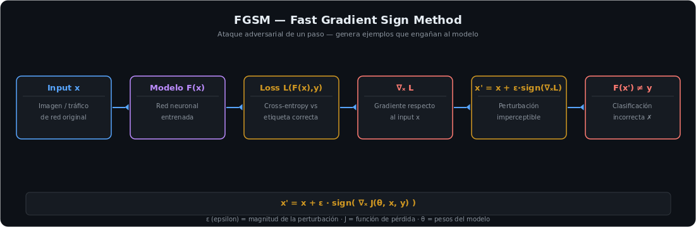

<h1 align="center">IA y Ciberseguridad</h1>

<p align="center">
  
  
  
  
</p>

---

## Sobre este módulo

Machine learning aplicado a ciberseguridad de punta a punta: detección de spam y churn, comparación de modelos de ensemble (Bagging, Random Forest, Gradient Boosting, XGBoost, LightGBM), y **ataque + defensa adversarial real** (FGSM) sobre un clasificador de phishing con ART. Incluye un ejercicio deliberadamente diseñado como trampa — un dataset de ataques cuyo valor está en darse cuenta de que **no tiene patrones reales que aprender**.

---

## Ataque adversarial (FGSM) — ataque y defensa reales

Entrené un `RandomForestClassifier` para detectar phishing, lo envolví con **ART (Adversarial Robustness Toolbox)** y lo ataqué con **FGSM** (Fast Gradient Sign Method): una perturbación calculada en la dirección del gradiente de la pérdida, imperceptible para el ojo humano, que hizo caer la accuracy del modelo de forma significativa. Luego apliqué **adversarial training** (reentrenar incluyendo ejemplos adversariales) y la accuracy se recuperó.

```python
rf.fit(X_train, y_train)                                  # accuracy original
attack = FastGradientMethod(estimator=art_classifier, eps=0.1)
X_adv = attack.generate(X_test)                            # accuracy cae bajo ataque
trainer = AdversarialTrainer(art_classifier, attacks=attack).fit(X_train, y_train)
                                                            # accuracy se recupera con defensa
```



**Lección:** un modelo con alta precisión no es necesariamente robusto — la superficie de ataque de un sistema de detección basado en ML incluye al propio modelo.

---

## Detección de spam y churn (fundamentos + métricas)

| Caso | Problema | Métrica elegida | Por qué |
|---|---|---|---|
| Spam en emails | Clasificación binaria | **F1-score** | Un falso negativo (spam no detectado) llega al usuario; accuracy sola engaña si hay desbalanceo |
| Churn de clientes (~85/15 desbalanceado) | Clasificación binaria | **F1 + ROC-AUC**, comparando LR balanceada / Decision Tree / Random Forest | Accuracy es engañosa en clases desbalanceadas — Random Forest con F1 en GridSearch fue la combinación más robusta |

---

## Comparativa de modelos de ensemble

Practicados sobre datasets reales (cáncer de mama, diabetes Pima, demanda de bicicletas, MNIST): **Decision Tree** (importancias "puntiagudas", 1-2 features dominan) → **Bagging/Random Forest** (reparte importancia entre subconjuntos de datos/features, más estable) → **Gradient Boosting / XGBoost / LightGBM** (mejor rendimiento ajustando `learning_rate` × `max_depth` × `n_estimators`, a costa de más tiempo de entrenamiento).

---

## La "kata de ML" — cuando el dato correcto es no encontrar nada

Práctica final sobre `cybersecurity_attacks.csv` (40.000 filas, 25 columnas, target `Action Taken`). Tras EDA, prueba de correlación categórica (Cramér's V) y modelado con Random Forest, la conclusión fue que **los datos son sintéticos y aleatorios: ningún modelo supera el ~33% en un problema de 3 clases**, sin importar el algoritmo o los hiperparámetros.

> Este tipo de ejercicio se usa en procesos de selección para evaluar si el candidato entiende qué está pasando con los datos — en vez de forzar métricas artificialmente sobre un problema que no tiene solución. Una conclusión correcta y bien razonada vale más que una métrica alta sin comprensión.

---

## Stack

`Python` · `scikit-learn` · `XGBoost` · `LightGBM` · `ART (Adversarial Robustness Toolbox)` · `pandas` · `matplotlib / seaborn`

---

## Objetivos cumplidos

- [x] Clasificadores de spam y churn evaluados con la métrica correcta para cada desbalanceo
- [x] Comparativa práctica de Decision Tree, Bagging, Random Forest, Gradient Boosting, XGBoost y LightGBM
- [x] Ataque adversarial FGSM ejecutado y defendido con adversarial training (ART)
- [x] Identificación correcta de un dataset sin señal real (kata de ML) en vez de forzar una métrica

---

## Módulos relacionados

- **[Análisis de Malware](https://github.com/juanmalbran/Analisis-de-Malware)** — ataques adversariales para evadir detectores de malware basados en ML.
- **[Blue Team](https://github.com/juanmalbran/Blue-Team)** — el ML aplicado a detección de anomalías se integra en el pipeline del SOC.

---

<div align="center">
  <sub>Parte del portfolio de <a href="https://github.com/juanmalbran">Juan Malbrán · M4LBYTE</a></sub>
</div>
